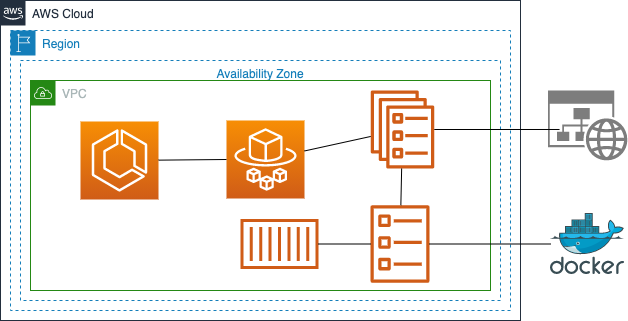

# ECS Fargate Service Module

This is an example of how to use Terraform to deploy an [ECS Fargate Service](https://aws.amazon.com/ecs/) with an 
[Application Load Balancer (ALB)](https://aws.amazon.com/elasticloadbalancing/application-load-balancer/) in front of 
it. See the [root README](/README.md) for instructions on how to run this example code. 

